# Data Lakehouse

> **Why Data Lakehouse?** Modern businesses generate massive amounts of data every day. Storing all of it in a traditional data warehouse is too expensive, but only storing it in a data lake makes it hard to analyze. A **Data Lakehouse** solves this problem by combining the low-cost storage of a Data Lake with the fast query performance of a Data Warehouse. It lets you keep all your data in one place, run SQL analytics on it, and save thousands of dollars compared to buying commercial database warehouse software. With open-source tools like Apache Spark, Apache Iceberg, Trino, and MinIO, you can build a powerful analytics platform without paying any licensing fees.

## Table of Contents

- [Data Lakehouse](#data-lakehouse)
  - [Table of Contents](#table-of-contents)
  - [1. Introduction](#1-introduction)
    - [1.1 What is Data Lakehouse?](#11-what-is-data-lakehouse)
    - [1.2 OLTP vs OLAP Database](#12-oltp-vs-olap-database)
    - [1.3 Why Build an OLAP System?](#13-why-build-an-olap-system)
    - [1.4 Cost Savings](#14-cost-savings)
  - [2. Architecture](#2-architecture)
    - [2.1 Architecture Diagram](#21-architecture-diagram)
    - [2.2 Components Overview](#22-components-overview)
    - [2.3 PostgreSQL (OLTP Database)](#23-postgresql-oltp-database)
    - [2.4 Apache Spark (ETL Engine)](#24-apache-spark-etl-engine)
    - [2.5 Apache Iceberg (Table Format)](#25-apache-iceberg-table-format)
    - [2.6 MinIO (Object Storage / Data Lake)](#26-minio-object-storage--data-lake)
    - [2.7 Trino (Query Engine)](#27-trino-query-engine)
    - [2.8 Metabase (Visualization)](#28-metabase-visualization)
  - [3. How to Run](#3-how-to-run)
    - [3.1 Start Infrastructure](#31-start-infrastructure)
    - [3.2 Seed Sample Data](#32-seed-sample-data)
    - [3.3 Run ETL Job](#33-run-etl-job)
    - [3.4 Query Data with Metabase](#34-query-data-with-metabase)
    - [3.5 Visualize with Metabase](#35-visualize-with-metabase)
  - [4. Evidence / Screenshots](#4-evidence--screenshots)
    - [4.1 Docker Deployment](#41-docker-deployment)
    - [4.2 Data Seeding Process](#42-data-seeding-process)
    - [4.3 ETL with Apache Spark](#43-etl-with-apache-spark)
    - [4.4 MinIO Object Storage](#44-minio-object-storage)
    - [4.5 Trino Query Engine](#45-trino-query-engine)
    - [4.6 Metabase Visualization](#46-metabase-visualization)
  - [5. Project Structure](#5-project-structure)

---

## 1. Introduction

### 1.1 What is Data Lakehouse?

A **Data Lakehouse** is a modern data architecture that combines the best features of a **Data Lake** and a **Data Warehouse** into one unified platform.

- **Data Lake** stores raw data (structured, semi-structured, unstructured) in low-cost object storage like MinIO or AWS S3. It is cheap but does not support SQL queries well.
- **Data Warehouse** stores organized, structured data optimized for SQL analytics. It is fast for reporting but expensive to maintain.

By combining both, a Data Lakehouse lets you store large amounts of data cheaply (like a Data Lake) while still being able to run fast SQL analytics on that data (like a Data Warehouse). This means you get the best of both worlds **without buying expensive proprietary database warehouse software** like Oracle Exadata, Snowflake, or Amazon Redshift.

### 1.2 OLTP vs OLAP Database

| Feature | OLTP (Online Transaction Processing) | OLAP (Online Analytical Processing) |
|---|---|---|
| **Purpose** | Handle day-to-day transactions (insert, update, delete) | Analyze large amounts of data for reporting |
| **Data Shape** | Current, real-time data | Historical, aggregated data |
| **Query Type** | Simple queries (one row at a time) | Complex queries (millions of rows) |
| **Example** | PostgreSQL, MySQL | Trino, Presto, Spark SQL |
| **Users** | Application developers, end users | Data analysts, business intelligence |

**OLTP** databases like PostgreSQL are great for running an e-commerce website where you need to quickly insert new orders, update inventory, and check customer information. But OLTP databases are **not designed for analytics** because running a query across millions of rows would slow down the transaction system.

That is why we need an **OLAP** system. We extract data from the OLTP database and move it into an OLAP-friendly format so analysts can run heavy queries without affecting the live application.

### 1.3 Why Build an OLAP System?

When your business grows, you will have thousands or millions of transaction records. Running reports directly on the OLTP database will:

1. **Slow down** the live application for customers
2. **Lock tables** and block other transactions
3. **Not perform well** for aggregation queries (SUM, AVG, GROUP BY)

An OLAP system solves these problems by:

1. **Separating** analytical workloads from transactional workloads
2. **Storing data** in columnar format (Parquet) which is optimized for analytics
3. **Allowing fast queries** across millions of rows without affecting the live system

### 1.4 Cost Savings

Traditional data warehouse solutions can cost **thousands to millions of dollars** per year in licensing fees. This project uses **100% open-source tools** that are free:

| Component | Commercial Alternative | Cost |
|---|---|---|
| PostgreSQL (OLTP) | Oracle Database | Free vs $?+/year |
| MinIO (Object Storage) | AWS S3 | Free vs Pay-per-use |
| Apache Spark (ETL) | Informatica / Talend | Free vs $?/year |
| Apache Iceberg (Table Format) | Delta Lake (Databricks) | Free vs $$$$ |
| Trino (Query Engine) | Snowflake / Redshift | Free vs $?+/year |
| Metabase (BI Tool) | Tableau / Power BI | Free vs $?+/user/month |

---

## 2. Architecture

### 2.1 Architecture Diagram

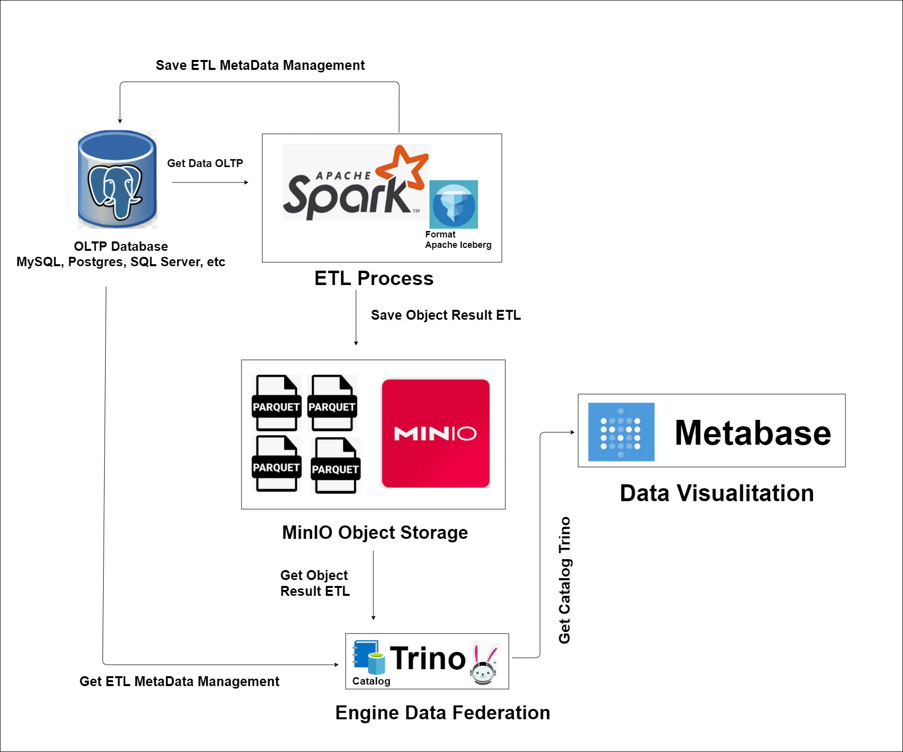

### 2.2 Components Overview

This project uses **6 open-source components** working together:

```
PostgreSQL (OLTP)  -->  Apache Spark (ETL)  -->  MinIO (Object Storage)
   [Source DB]             [Data Pipeline]          [Data Lake / Parquet Files]
                                |
                          Apache Iceberg
                          [Table Format]
                                |
                          Trino (Query Engine)
                          [SQL Analytics]
                                |
                          Metabase (Dashboard)
                          [Visualization]
```

### 2.3 PostgreSQL (OLTP Database)

PostgreSQL is the **source database** where the live e-commerce application stores its transaction data. It runs as a Docker container with the following settings:

- **Host**: `postgres` (internal) / `localhost:5432` (external)
- **Database**: `ecommerce_db`
- **User**: `admin` / **Password**: `password123`

All orders, customers, and transaction data live here. This is the OLTP system that handles real-time reads and writes.

### 2.4 Apache Spark (ETL Engine)

Apache Spark is the **ETL (Extract, Transform, Load) engine** that:

1. **Reads** data from PostgreSQL
2. **Filters** data older than 5 years (archival policy)
3. **Writes** data to Apache Iceberg format (Parquet files) on MinIO

Spark runs as a cluster with 1 master and 1 worker. It uses the Iceberg Spark Runtime JAR to support Iceberg table format natively.

### 2.5 Apache Iceberg (Table Format)

Apache Iceberg is an **open table format** that sits on top of Parquet files. It provides:

- **ACID transactions** (like a database, but on files)
- **Schema evolution** (change columns without breaking old data)
- **Time travel** (query data as it was at a specific time)
- **Partition evolution** (change partitioning without rewriting data)

Iceberg stores its metadata in PostgreSQL (via JDBC catalog) and the actual Parquet data files in MinIO.

### 2.6 MinIO (Object Storage / Data Lake)

MinIO is an **S3-compatible object storage** that acts as the Data Lake. It stores:

- **Parquet data files** (the actual data in columnar format)
- **Iceberg metadata files** (JSON files that describe the table structure)
- **Manifest files** (which Parquet files belong to which snapshot)

MinIO provides a web console at `http://localhost:9001` where you can browse the stored files.

### 2.7 Trino (Query Engine)

Trino is a **distributed SQL query engine** that can query data from multiple sources using a single SQL interface. In this project, Trino:

1. Reads Iceberg table metadata from PostgreSQL
2. Reads Parquet data files from MinIO
3. Provides a SQL interface for analysts to query the archived data

Trino acts as the **bridge** between the data lake (MinIO) and the visualization tools (Metabase). It uses the Iceberg connector to understand the table format.

### 2.8 Metabase (Visualization)

Metabase is an **open-source business intelligence (BI) tool** that connects to Trino and creates dashboards and reports from the data lakehouse. It provides a user-friendly interface for non-technical users to explore data without writing SQL.

---

## 3. How to Run

### 3.1 Start Infrastructure

Start all Docker containers:

```bash
docker-compose up -d
```

This will start: PostgreSQL, MinIO, Spark (master + worker), Trino, and Metabase.

### 3.2 Seed Sample Data

Install Python dependencies and generate sample data:

```bash
pip install -r requirements.txt
python src/seed/generate_data.py
```

This creates 2,000 sample e-commerce order records in PostgreSQL.

### 3.3 Run ETL Job

Run the Spark ETL job to archive old data to Iceberg format:

```bash
docker exec -it spark_master spark-submit \
  --master spark://spark-master:7077 \
  /opt/bitnami/spark/src/etl/archive_to_iceberg.py
```

This reads orders older than 5 years from PostgreSQL and writes them as Parquet files in MinIO via Iceberg format.

### 3.4 Query Data with Metabase

Access Trino Web UI at `http://localhost:13000` and run SQL queries:

```sql
SELECT * FROM iceberg.db_ecommerce.archived_orders LIMIT 10;

SELECT status, COUNT(*), SUM(order_amount)
FROM iceberg.db_ecommerce.archived_orders
GROUP BY status;
```

### 3.5 Visualize with Metabase

1. Open Metabase at `http://localhost:13000`
2. Add a new database connection:
   - **Type**: Starburst (Trino)
   - **Host**: `trino`
   - **Port**: `8080`
   - **Catalog**: `iceberg`
3. Create dashboards and reports from the `archived_orders` table

---

## 4. Evidence / Screenshots

### 4.1 Docker Deployment

**1. Docker containers deployed successfully**

All services (PostgreSQL, MinIO, Spark, Trino, Metabase) are running as Docker containers.

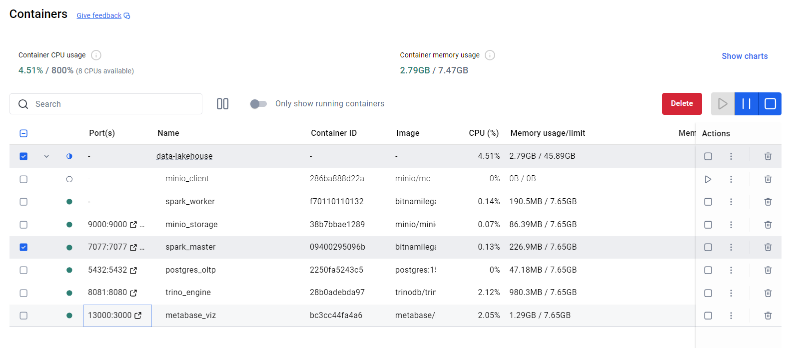

---

### 4.2 Data Seeding Process

**2. Sample data import to PostgreSQL**

Data seeding script imports sample e-commerce data into PostgreSQL.

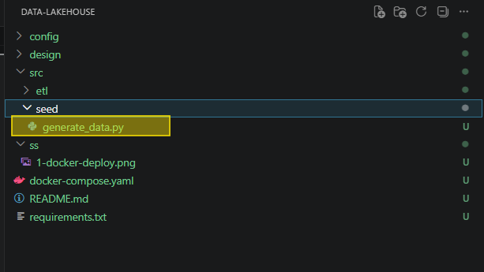

**3. Data imported from Python script**

The Python seed script (`generate_data.py`) generates and inserts sample data.

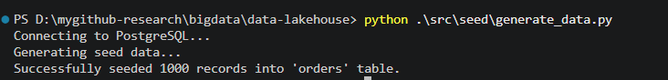

**4. 2,000 transaction records imported to PostgreSQL**

The seed script successfully imported 2,000 sample transaction records into the PostgreSQL `ecommerce_db` database.

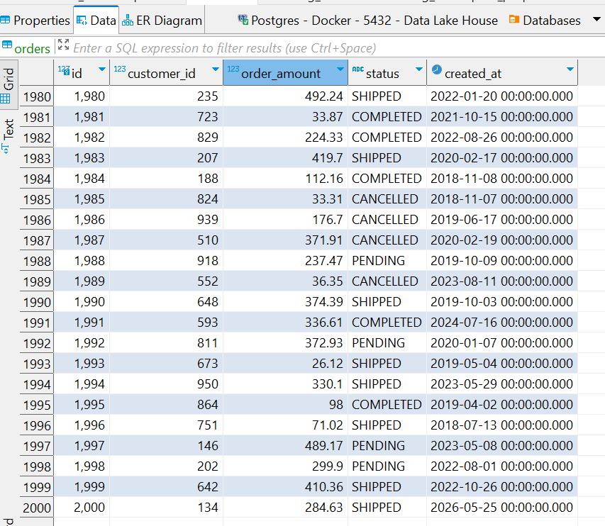

---

### 4.3 ETL with Apache Spark

**5. Spark configuration connecting to PostgreSQL and MinIO**

The `spark-defaults.conf` configures Spark to connect to PostgreSQL (for reading source data) and MinIO (for writing Iceberg/Parquet files).

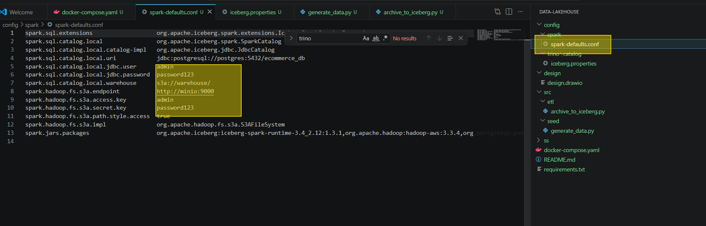

**6. ETL process: PostgreSQL to Iceberg format on MinIO**

The ETL job reads data from PostgreSQL, converts it to Apache Iceberg format, and saves it to MinIO object storage.

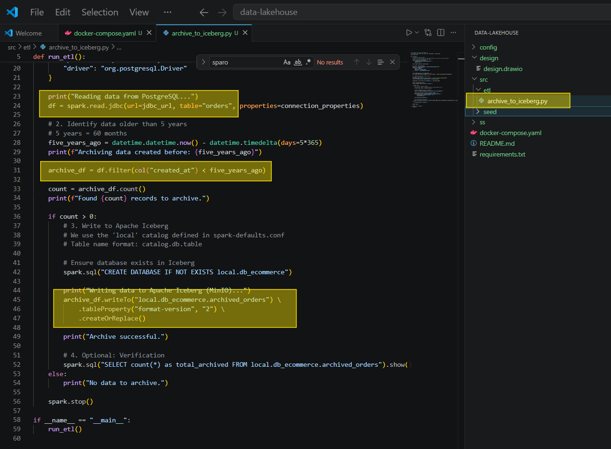

**7. Spark ETL job running (part 1)**

The ETL job is running inside the Spark container, processing the archival logic.

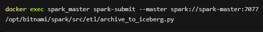

**8. Spark ETL job running (part 2)**

Continuation of the ETL process showing data being written to Iceberg format.

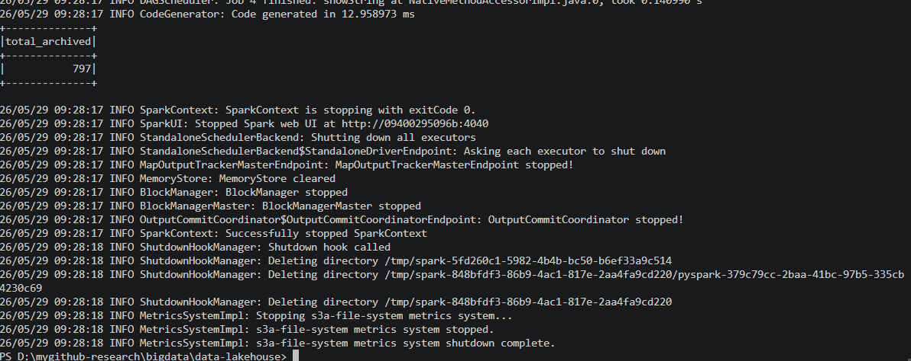

**9. Iceberg metadata process evidence (part 1)**

Evidence showing Iceberg metadata files being created during the ETL process.

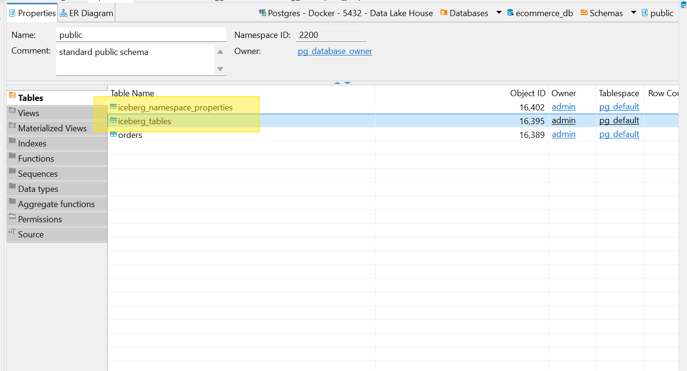

**10. Iceberg metadata process evidence (part 2)**

Additional evidence of Iceberg metadata creation, showing snapshot and manifest files.

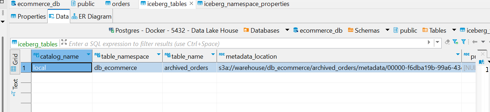

**11. Spark Dashboard showing ETL application status**

The Spark Master Dashboard at `http://localhost:8080` shows the ETL application running with its status and metrics.

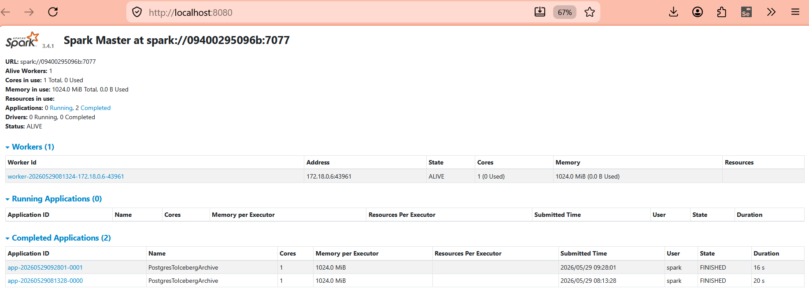


---

### 4.4 MinIO Object Storage

**12. Parquet files stored in MinIO**

After the ETL process, the data is saved as Parquet files in MinIO, organized by database and table name from PostgreSQL.


---

### 4.5 Trino Query Engine

**13a. Trino catalog name set to "iceberg"**

The Trino catalog configuration (`iceberg.properties`) defines the Iceberg connector that reads data from MinIO via PostgreSQL JDBC catalog.

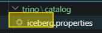

**13b. Trino configuration integrating with MinIO and PostgreSQL**

The Iceberg connector config connects Trino to PostgreSQL (for metadata) and MinIO (for Parquet data files).

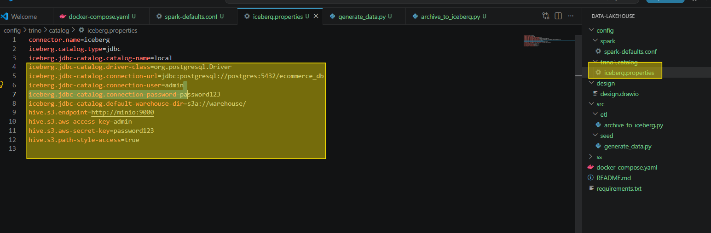

**14. Trino username and password configuration**

Trino authentication settings for connecting from client tools like Metabase.

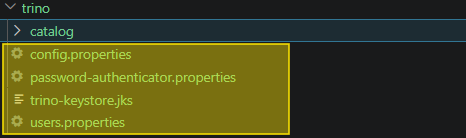

**15. Trino Dashboard showing data federation driver**

The Trino Web UI at `http://localhost:8081` shows running queries and connected data sources.

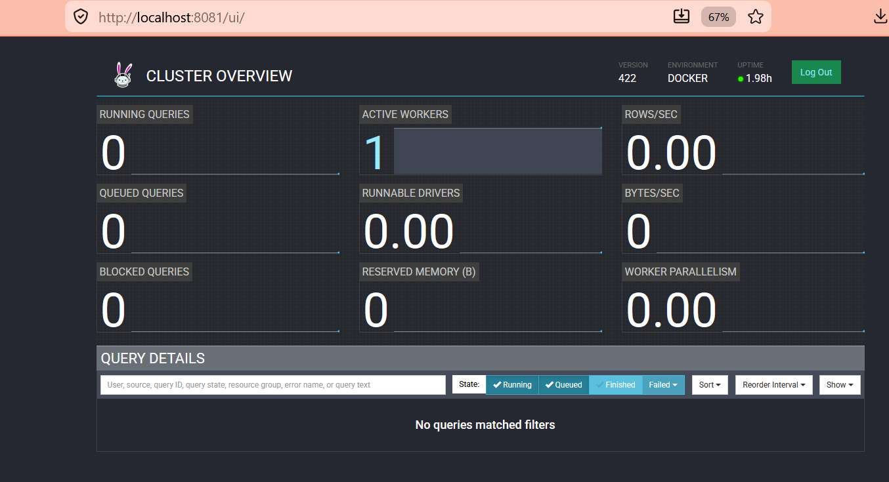

---

### 4.6 Metabase Visualization

**16. Metabase configuration connecting to Trino**

Metabase is configured with the Starburst (Trino) connector to read data from the Iceberg tables via Trino.

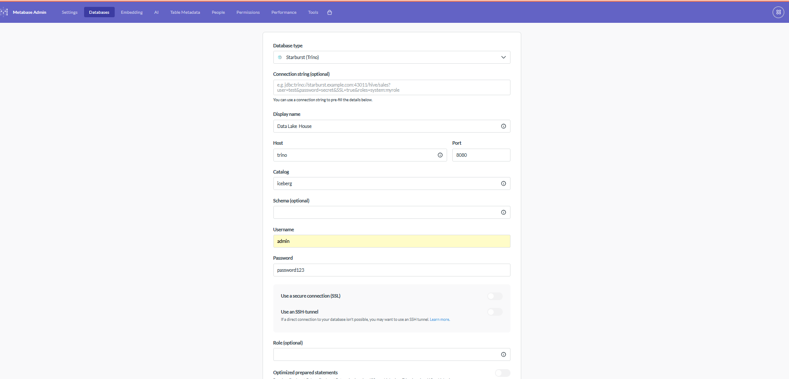

**17. Metabase listing data from Trino reading MinIO**

Metabase successfully connects to Trino and can see the `archived_orders` table from the Iceberg catalog.

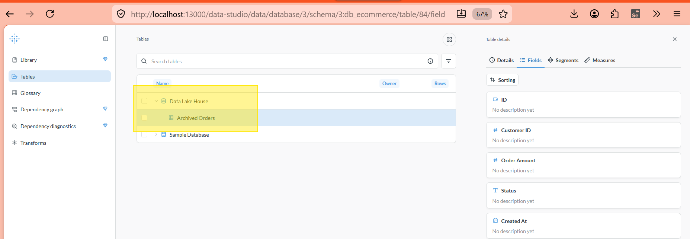

**18. Metabase viewing the data**

Metabase displays the archived orders data, ready for building dashboards and reports.

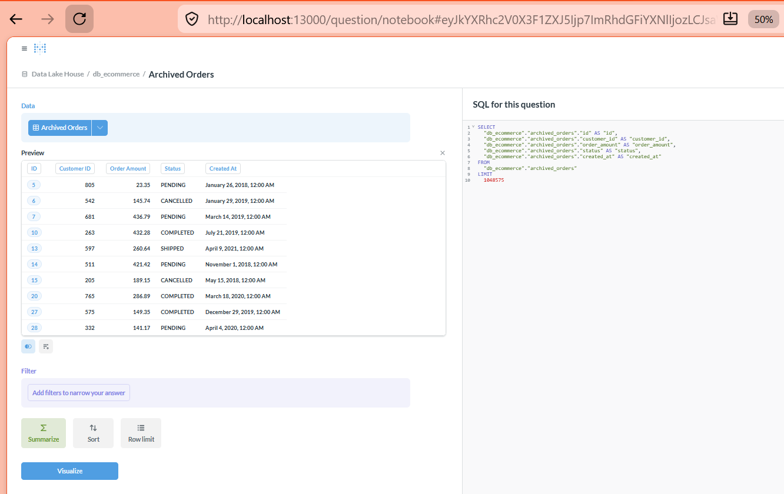

---

## 5. Project Structure

```
data-lakehouse/
|-- docker-compose.yaml              # Docker services definition
|-- requirements.txt                 # Python dependencies
|-- README.md                        # Project documentation
|-- config/                          # Configuration files for all services
|   |-- spark/
|   |   |-- spark-defaults.conf      # Spark + Iceberg + S3A config
|   |-- trino/
|       |-- catalog/
|       |   |-- iceberg.properties   # Trino Iceberg connector config
|       |-- config.properties        # Trino server config
|       |-- users.properties         # Trino user credentials
|       |-- password-authenticator.properties  # Trino auth config
|-- design/
|   |-- arsitekur.png                # Architecture diagram
|   |-- design.drawio                # Architecture source (draw.io)
|-- docs/
|   |-- architecture_iceberg_explained.md   # Iceberg architecture docs
|   |-- trino_authentication_explained.md   # Trino auth docs
|-- src/
|   |-- etl/
|   |   |-- archive_to_iceberg.py    # Spark ETL: PostgreSQL -> Iceberg
|   |-- seed/
|   |   |-- generate_data.py         # Sample data generator
|   |-- trino/
|       |-- read_iceberg_archived_orders.sql  # Trino SQL queries
|-- ss/                              # Evidence screenshots (1-18)
```

